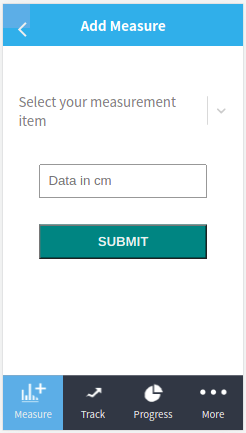

# Tracking App

## Project Description

This is a web application designed to track measurements of body parts(Biceps, Thighs, Hip, and Waist) from an API, built with Rails. . It fetches data such as measurements from the back-end API and equally allows users to post new measurements data.
Here is the back-end repository ([API Repo](https://github.com/FrederickMih/Tracking-app-api))

## Screenshots

 

### Features

- Login with username
- Responsive design that works for Mobile, Tablet and Desktop
- Track measurement data such for Left and Right Biceps, Left and Right Thighs, Hip and Waist
- Post new measurement data

### Built with

- ReactJS
- ReactDOM
- React-Create-App
- Redux
- npm
- CSS
- ES6
- Ruby on Rails for Backend API ([API Repo](https://github.com/FrederickMih/Tracking-app-api))

## Live Demo

[Try it out here]()

## Set up this project locally

- Open the terminal in the folder where you want to install the app;
- Run `https://github.com/FrederickMih/Tracking-App-Front-end` to clone the project;
- Switch to the main directory of project using cd;
- Run `npm install` in your terminal to install all dependencies (you will need Node.js installed on your machine);
- Run `npm start`;

# Testing

- Please run test using the command:
- `npm test`

👤 **Mih Frederick**

## 🤝 Contributing

Contributions, issues, and feature requests are welcome!

If you want to contribute, you can clone this project or fork it.

If you found an issue, feel free to check the [issues page](https://github.com/FrederickMih/Tracking-App-Front-end/issues).

## Show your support

Give a ⭐️ if you like this project!

## Acknowledgments

- [Microverse](https://www.microverse.org/)

## License

MIT License
